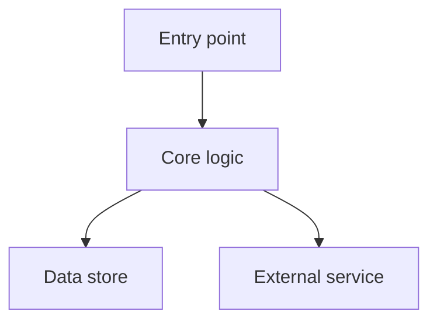

# TDD Template — Component Technical Design Document

**Usage:** Copy this template when creating a new component TDD. Fill in each section. Delete sections that don't apply to your component and note the deletion reason. New TDDs require CTO approval before merging.

**File naming convention:** `<component>_tdd.md` in the owning repo's `docs/design/` directory, or `docs/tdd.md` for the repo master TDD.

---

# [Component Name] — Technical Design Document

**Document Version:** 1.0  
**Last Updated:** [YYYY-MM-DD]  
**Last Verified:** [YYYY-MM-DD] — ⚠️ Remove this banner once verified against code.  
**Audience:** Engineers working in or integrating with this component  
**Owning repo:** [core / ssi / ui / infra]  
**Status:** [DRAFT / ACTIVE / DEPRECATED]

---

## 1. Purpose and Scope

One paragraph. What does this component do? What are its explicit boundaries — what does it do, and what does an adjacent component handle?

**In scope:**

- ...

**Out of scope (owned by another component):**

- ...

---

## 2. Architecture Overview

Mermaid diagram showing:

- The component's internal structure (key classes, modules, data stores)
- Its integration points with other components (request/response arrows, labeled)
- Data flow direction

---

## 3. Component Index

For master TDDs (repo-level `tdd.md`): a table linking to each subsystem's detailed design doc.

| Subsystem        | Description  | Document                   | Last Verified |
| ---------------- | ------------ | -------------------------- | ------------- |
| [Subsystem name] | One sentence | [link](./subsystem_tdd.md) | [date]        |

For feature TDDs: omit this section or replace with a reference to the master TDD.

---

## 4. Key Design Decisions

For each significant decision:

| Decision     | Alternatives Considered | Rationale         | Consequences                              |
| ------------ | ----------------------- | ----------------- | ----------------------------------------- |
| [Decision A] | [Alt 1], [Alt 2]        | [Why this choice] | [What it locks us into / what it enables] |

See `planning/architecture/adr/` for formal ADRs when available.

---

## 5. API Surface

Reference or inline description of the public interface.

- **For services**: link to `api_reference.md` or describe the key endpoints here. Include: method, path, auth requirement, request shape, response shape.
- **For internal modules**: describe the key classes and public methods.
- **For jobs**: describe the entry point, input parameters, expected output artifacts.

> If the API is stable and documented elsewhere, just link: "See [api_reference.md](./api_reference.md)."

---

## 6. Data Model

Describe the key data structures this component owns.

- Tables, collections, or file structures
- Field semantics (especially for non-obvious fields)
- Encryption or privacy constraints on specific fields
- Retention policy

> If the data model is fully documented in `data_model.md` or `storage.md`, link to those and note what this component adds.

---

## 7. Configuration Reference

What settings control this component's behavior?

| Setting       | Env var            | Default         | Description      |
| ------------- | ------------------ | --------------- | ---------------- |
| `section.key` | `I4G_SECTION__KEY` | `default_value` | What it controls |

Link to the full manifest: `core/docs/config/` or `ssi/config/settings.default.toml`.

---

## 8. Environment-Specific Behavior

What changes between `local`, `dev`, and `prod`?

| Behavior            | `local` | `i4g-dev` | `i4g-prod` |
| ------------------- | ------- | --------- | ---------- |
| [Auth mode]         | mock    | OIDC      | OIDC       |
| [Data store]        | SQLite  | Cloud SQL | Cloud SQL  |
| [Key behavior diff] | ...     | ...       | ...        |

---

## 9. Development Workflow

A concise checklist for making changes to this component. Link to the full dev guide for details.

- [ ] Read [`dev_guide.md`](../development/dev_guide.md) for environment setup
- [ ] Understand the affected subsystem by reading its linked design doc (Section 3)
- [ ] Write tests under `tests/unit/` — run: `conda run -n i4g pytest tests/unit -x`
- [ ] If adding env vars: add coverage under `tests/unit/settings/` and update `docs/config/settings_manifest.yaml`
- [ ] Run pre-commit: `conda run -n i4g pre-commit run --files <changed-files>` (two passes)
- [ ] Update this document's **Last Verified** date if the document is affected

---

## 10. Known Limitations and Future Work

What does this design not yet handle? What are the known rough edges?

- ...

Link to planning/roadmap.md or relevant PRDs for planned improvements.

---

## 11. Related Documents

| Document                                                                           | Relationship                                            |
| ---------------------------------------------------------------------------------- | ------------------------------------------------------- |
| [`system_narrative.md`](../../planning/architecture/system_narrative.md)           | Platform overview — this component's place in the whole |
| [`integration_contracts.md`](../../planning/architecture/integration_contracts.md) | Cross-service integration details                       |
| [`architecture.md`](architecture.md)                                               | System-level architecture                               |
| [`data_model.md`](data_model.md)                                                   | Shared data model                                       |
| [`storage.md`](storage.md)                                                         | Storage backends                                        |
